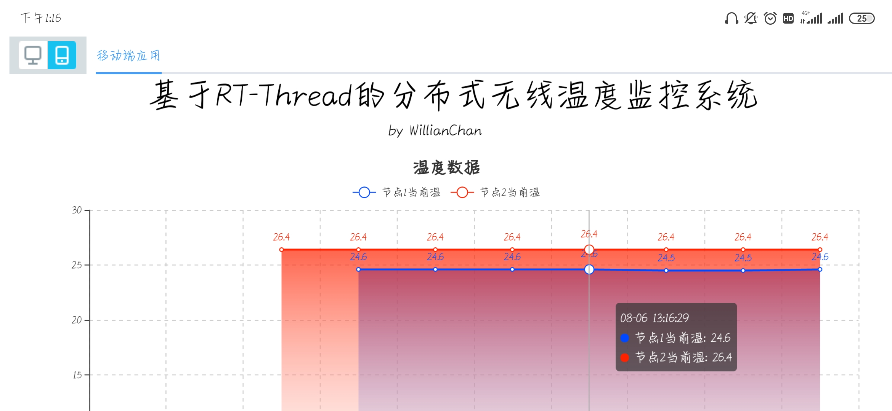

# 智能家居 DIY 教程连载（4）

> MQTT, OneNet Cloud

Hi，各位小伙伴，DIY 活动已经来到了尾声，第四周的任务

## 本文目录

- 1. 第四周任务概览
- 2. 写点啥呢？
- 3. 开源代码
- 4. 结果展示
- 5. 注意事项

## 1. 第四周任务概览

- ~~接收节点根据上位机数据帧格式，通过串口发送温度数据给上位机，上位机能正确显示温度曲线~~
- 了解 RT-Thread 的 OneNet 云软件包、AT 组件，并使用它们实现将接收节点的数据通过 esp8266 wifi 模块上传至 OneNet 云端，云端要求能简单制作小应用实现实时温度远程监控

## 2. 写点啥呢？

不知道写点啥....

## 3. 开源代码

为了更进一步便于大家学习，第三周任务的代码已经开源啦~ [请点击这里查看](https://github.com/willianchanlovegithub/DIY_projects_base_on_RT-Thread)

## 4. 结果展示

- 在网页上查看 OneNet 云端数据，能正常收到来自每个发送节点数据流了： 

- OneNet PC端应用，可在电脑实现远程监控：

- OneNet 移动端应用，可在手机平板等设备实现远程监控：

- 本地 FinSH 信息输出，提示mqtt初始化成功和数据上传 OneNet 服务器成功：

## 5. 注意事项

- 第四周的 demo 工程中只接收两个发送节点的数据，需要更多发送节点的可以自行添加。

- 第四周的 demo 工程的文件系统是挂载在 SD Card 上的，需要挂载在 SPI Flash 上的请自行参考第三周的 demo 工程。

- 发送节点的程序下载第二周中的 demo 就好了，GitHub 中的 `Fourth week mission` 文件夹不再包含发送节点工程。

- 移动端需要在 OneNet 官网下载一个叫设备云的 APP，点击此[链接](https://open.iot.10086.cn/doc/art656.html#118)跳转至官网下载页面：

